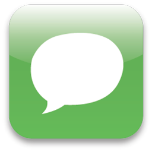

[![LinkedIn][linkedin-shield]][linkedin-url]


<!-- PROJECT LOGO -->
<br />
<p align="center">
  <a href="https://bitbucket.org/nomair/open-chat/src/master/">
    
  </a>

  <h3 align="center">Open Chat</h3>

  <p align="center">
    An open chat room where users can send and receive messages in real-time!
    <br />
    <a href="https://bitbucket.org/nomair/open-chat/src/master/"><strong>Explore the docs »</strong></a>
    <br />
    <br />
    <a href="https://bitbucket.org/nomair/open-chat/src/master/images/demo.gif">View Demo</a>
   
</p>


<!-- TABLE OF CONTENTS -->
<details open="open">
  <summary>Table of Contents</summary>
  <ol>
    <li>
      <a href="#about-the-project">About The Project</a>
      <ul>
        <li><a href="#built-with">Main Points</a></li>
        <li><a href="#built-with">Built With</a></li>
      </ul>
    </li>
    <li>
      <a href="#getting-started">Getting Started</a>
      <ul>
        <li><a href="#prerequisites">Prerequisites</a></li>
        <li><a href="#installation">Installation</a></li>
      </ul>
    </li>
    <li><a href="#usage">Try it!</a></li>
    <li><a href="#contributing">Contributing</a></li>
    <li><a href="#license"> License</a></li>
    <li><a href="#contact">Contact</a></li>

  </ol>
</details>


<!-- ABOUT THE PROJECT -->
## About The Project

![Product Name Screen Shot][product-screenshot]

An open chat room without registration;  to join the room, the user needs to enter an identification (nickname); When entering the Chat room, the list of messages already sent in this room is being displayed in increasing order; During the conversation, the user can view new messages sent and also be alerted when another user enters/or leaves the Chat; The user can leave the chat at any time, through a logoff button. When exiting the application without logging off, the user remains logged on and able to send messages when he returns to the application;


### Main Points

* For now, the nickname is unique so if two users picked the same nickname, they will be treated as one user;
* The first two letters of the user nickname are part of his profile picture;
* The Backend is ready to receive  the user profile picture URL, but it's not mandatory because its not implemented in the Frontend

### Built With

* Front-end: ReactJs
* Back-end: Node.js
* API: Apollo Express GraphQL
* BD: MongoDB


<!-- GETTING STARTED -->
## Getting Started

You can clone and run Open Chat by following the steps below

### Prerequisites

Make sure to have npm installed

* npm
  ```sh
  npm install npm@latest -g
  ```

### Installation

1. Clone the repo
   ```sh
   git clone https://bitbucket.org/nomair/open-chat.git
   ```
2. Install NPM packages in both [API](https://bitbucket.org/nomair/open-chat/src/master/api/) and [APP](https://bitbucket.org/nomair/open-chat/src/master/app/) directories 
   ```sh
   npm install
   ```
3. Enter your configurations in [Config.js](https://bitbucket.org/nomair/open-chat/src/master/api/src/config.js)
  


<!-- USAGE EXAMPLES -->
## Usage

1. Run the Server in [API](https://bitbucket.org/nomair/open-chat/src/master/api/) directory
   ```sh
     npm start
   ```
1. Run the Client Side in [APP](https://bitbucket.org/nomair/open-chat/src/master/app/) directory
   ```sh
   npm start
   ```

<!-- CONTRIBUTING -->
## Contributing

Contributions are what make the open source community such an amazing place to be learn, inspire, and create. Any contributions you make are **greatly appreciated**.

1. Fork the Project
2. Create your Feature Branch (`git checkout -b feature/AmazingFeature`)
3. Commit your Changes (`git commit -m 'Add some AmazingFeature'`)
4. Push to the Branch (`git push origin feature/AmazingFeature`)
5. Open a Pull Request


<!-- LICENSE -->
## License

Distributed under the MIT License.


<!-- CONTACT -->
## Contact 

Nomair Ghanem  - nominaw@gmail.com

Project Link: [https://bitbucket.org/nomair/open-chat/](https://bitbucket.org/nomair/open-chat/)


<!-- MARKDOWN LINKS & IMAGES -->
[linkedin-shield]: https://img.shields.io/badge/-LinkedIn-black.svg?style=for-the-badge&logo=linkedin&colorB=555
[linkedin-url]: https://www.linkedin.com/in/nomair-ghanem-17403377/
[product-screenshot]: images/demo.gif
